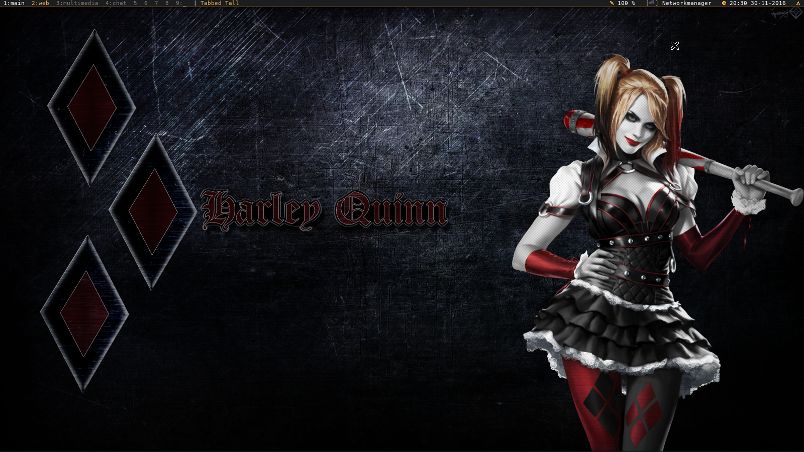

PyBar Readme file
=================

PyBar is a status bar application for XWindow written in Python.
It can be used in combination with tiling lightweight desktop environments.
PyBar can easily be extended by writing widgets.

_NOTE_: PyBar is not a finished application, but feel free to use or improve it.



Motivation
----------
Lightweight or tiled Linux window managers do usually not provide a
full-fledged desktop environment. Users of these systems may want to have some
information, such as the current time or system status, nicely visible on the
screen. PyBar, in combination with Dzen2, can be used to achieve this. By
placing several widgets on the PyBar, PyBar presents information in an elegant
way to the user. In this way the user can easily see the current time,
battery status, or network status without the need for a full (resource
unfriendly) desktop environment.

There are many alternatives to PyBar. For instance, `Conky` can be used to
feed information to `Dzen2`. The main motivation of PyBar is that I wanted to
be in full control of my status bar, and to have some fun `:)` when developing
it. I share this project on GitHub, because I am not completely unhappy with
PyBar. It also runs nicely together with my XMonad installation. Perhaps it can
be of use to you as well. If you find a bug, please report it.


Creating a configuration, and running it
----------------------------------------
PyBar has no nice configuration utility. Instead, you have to write a small
python application that acts as some sort of configuration. The easiest way to
create a configuration is to create a new file in the same folder as the PyBar
package lives in.

Below a sample configuration is given. The example prints the time at the
right side of the bar. On the left side, text from `stdin` is printed.

```python
#!/bin/python

from pybar.application import run
from pybar.bar import Bar
from pybar.widgets.clock import Clock
from pybar.widgets.inputreader import InputReader

if __name__ == "__main__":
    # Create 1920x14 status bar
    topbar = Bar(iconcolor="#EBAC54")
    topbar.addWidgetLeft(InputReader())
    topbar.addWidgetRight(Clock())
    run()
```

Save the configuration as `mybar.py`. Make sure you mark the file as executable
(`chmod +x mybar.py`). Now simply run it: `./mybar.py`. As the `InputReader()`
is used, `stdin` is redirected to the bar; so try to type anything in the bar
it's terminal session, and see how it's placed on the top left of the bar.


Available Widgets
-----------------
In this Section, the available PyBar widgets are listed. For each widget, also
Python code is given which demonstrates how to initialize the widget. Note that
there are not that many Widgets available. However they may give you some nice
functionalities. Writing a new widget is not that difficult. For hints on how
to write (and submit) your own widgets, have a look at one of the BONUS
sections in this document).

* `Clock` Prints the current system time and date.

      from pybar.widgets.clock import Clock
      Clock()

  Optional keywords arguments can be used to customize:

    - `showDate=True` Flag that indicates whether the date should be shown,
    - `timezone=None` to show a clock in a different timezone
    - `prefix=None`   to add a textual prefix before the printed time (e.g.
                      indicate the timezone)

  Example:

      import pytz # Python timezone: http://pypi.python.org/pypi/pytz
      from pybar.widgets.clock import Clock
      Clock(showDate=True, timezone=pytz.timezone('US/Pacific-New'), prefix="CA")


* `InputReader` Prints `stdin` in the status bar. The input text is formatted
   using the Dzen2 format.

      from pybar.widgets.inputreader = InputReader
      InputReader()

   Available formatting commands are:

    - `^fg(#COLOR)` set foreground (text) color
    - `^bg(#COLOR)` set background (text) color
    - `^i(path)`    draws a XBM icon


* `Tray` `Trayer` Placement of tray icons in the status bar.

      from pybar.widgets.tray import Tray
      topbar = Bar(...) # See config example
      Tray(barwindow=bar.window)


* `BattMon` Prints the battery charged percentage for each of your batteries.
   Requires that you have `UPower` installed on your system.

      from pybar.widgets.battmon import BattMon
      BattMon()


* `Wicd` Prints the connection status and signal strength of your WIRELESS
  network for the Wicd network manager. Requires you to have configured Wicd
  (https://launchpad.net/wicd) as network manager.

      from pybar.widgets.wicd import Wicd
      Wicd()


* `EmailIMAP` Prints the number of unread messages in your IMAP-inbox. Requires
   that you have `IMAPClient` (http://imapclient.freshfoo.com/) installed on
   your system. Since the IMAPClient implementation does not detect network
   connection errors very well, a NetworkObserver callback is used to
   (re)connect if internet access becomes available.

   _NOTE_: Be aware that the credentials are not stored in an encrypted form.

      from pybar.widgets.email import IMAP
      from pybar.network import NetworksObserver
      email = IMAP(
          hostname="localhost",
          username="<enter your imap username here>",
          password="<enter your imap password here>",
          useSSL=True,   # if not set, defaults to True
          use_uid=True   # if not set, defaults to True
      )
      networkobserver = NetworksObserver()
      networkobserver.addWidget(email)


* `ObShutdown` A simple widget which shows you an (Arch Linux `\0/` ) icon.
   If you click on this icon, `obshutdown` is executed. ObShutdown is a simple
   shutdown dialog (https://github.com/panjandrum/obshutdown/).

      from pybar.widgets.obshutdown import ObShutdown
      ObShutdown()


Installation
------------
PyBar comes without a setup. In order to get PyBar running, you can just clone
this GIT repository. After you have downloaded the source code, you can create
a configuration as described in the next section.

`PyBar` is written in Python, and depends on the following packages:

* Python2 _or_ Python3
* QT4
* Python XLib
* Python QT4 bindings (`pyqt4`)
* Python Image Library (`PIL` or `pillow`)
* Python Dbus


Bonus: PyBar and XMonad
-----------------------
XMonad (http://xmonad.org/) is a tiling window manager written in Haskell. It
is common (but not required) that XMonad users print some information on top of
the screen in some sort of status bar. The following XMonad configuration code
shows you how PyBar can be configured for this task.

_Note that there is no general way to do this. I present just one possibility._

First of all, download Dzen.hs from
`https://bitbucket.org/pelletier/dotfiles/src/5a44877b593b/xmonad/lib/Dzen.hs`
and place it in `~/.xmonad/lib.Dzen.hs`.


```haskell
import Dzen

-- Define a loghook 
logHook' h = dynamicLogWithPP $ defaultPP {
    ppCurrent = dzenColor "#ebac54" barBgColor . pad,
    ppVisible = dzenColor "yellow" barBgColor . pad,
    ppHidden = dzenColor "white" barBgColor . pad,
    ppHiddenNoWindows = dzenColor "#7b7b7b" barBgColor . pad,
    ppUrgent = dzenColor "red" barBgColor . pad,
    ppWsSep = "",
    ppSep = " | ",
    ppLayout = dzenColor "#ebac54" barBgColor,
    ppTitle = dzenColor "white" barBgColor . dzenEscape,
    ppOutput = hPutStrLn h
}

```

In your main loop, put the following Haskell code (where you have to fix the path to the PyBar config file):

```haskell
main = do
    statusBar <- spawnPipe "~/path/to/yourconfig.py"
```

And output the loghook to the left Dzen2 instance (which now is called dzenTopBar)

```haskell
    xmonad $ withUrgencyHook NoUrgencyHook $ defaultConfig {
        -- you may have another config here
        logHook    = takeTopFocus >> logHook' statusBar,
        --
    }
```


Future work
-----------
Several things I want to implement, but that are not done yet`?`:

* Add a volume widget, ALSA and maybe PulseAudio.
* Add a general `bar` widget, that can show values in a rectangle (e.g.
  ```volume [======....]60%```).
* If possible, implement a Notifier-daemon .
* Dropbox widget, but seems quite problematic. I can not find a nice interface to access Dropbox from other applications. (I don't want to have to original Dropbox icon on my screen, it can live on my desktop9 (waste)-desktop).
* CPU status? (maybe, I don't miss this kind of widgets...)
* `Now playing...` widget for players that have implemented MPRIS (including Spotify, MPD, PyMP (my own unfinished creation `:P`) and other popular players.
* Flashing widgets (in case battery is almost dry)

